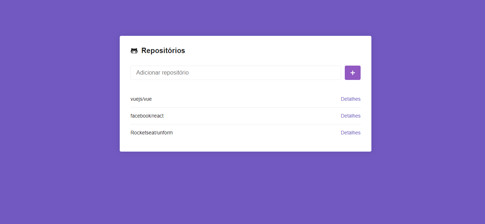
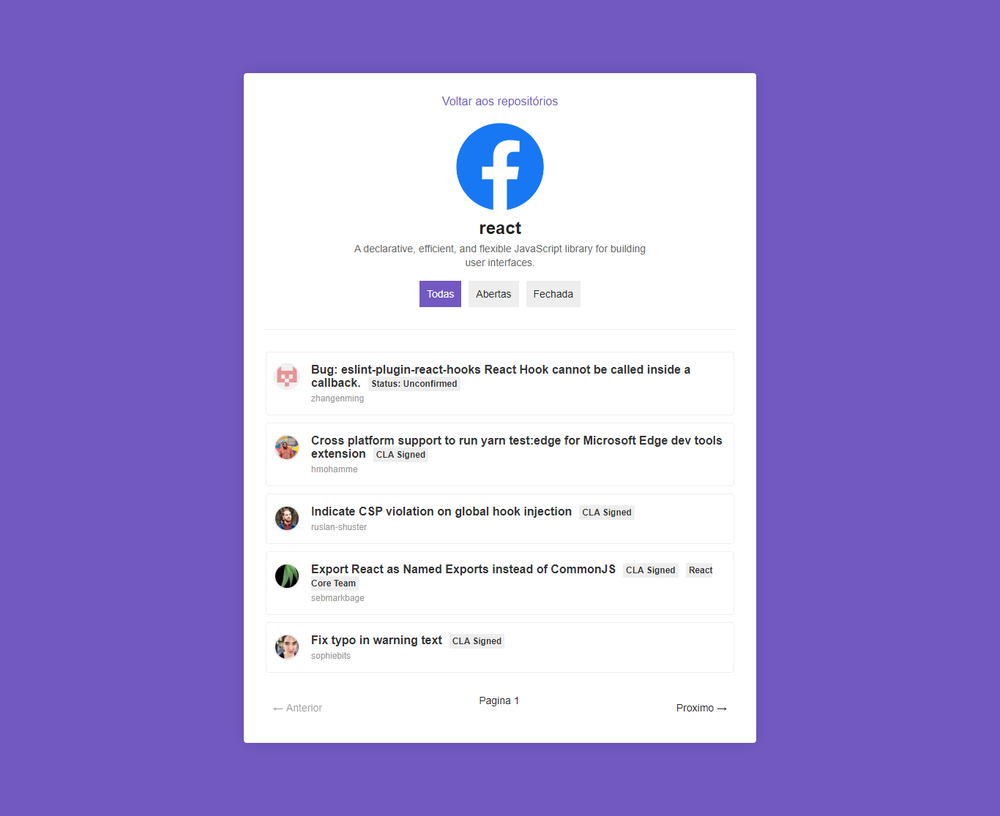

<h1 align="center">
    
</h1>

<h3 align="center">
  Desafio 5: Primeiro projeto com ReactJS
</h3>

## :rocket: Sobre a aplicação

Aplicação que permite cadastrar repositórios do GitHub e listar suas issues.

### [Live Demo](https://guihenrry-repohub.netlify.com/)




## :information_source: Como utilizar em 4 passos

```bash
# Clone o repositório
$ git clone https://github.com/Guihenrry/repohub.git

# Entre na pasta do repositório
$ cd repohub

# Instalar dependencias
$ yarn

# Execute o projeto
$ yarn start
```

Feito com ♥ by Gui Henrry ✌
